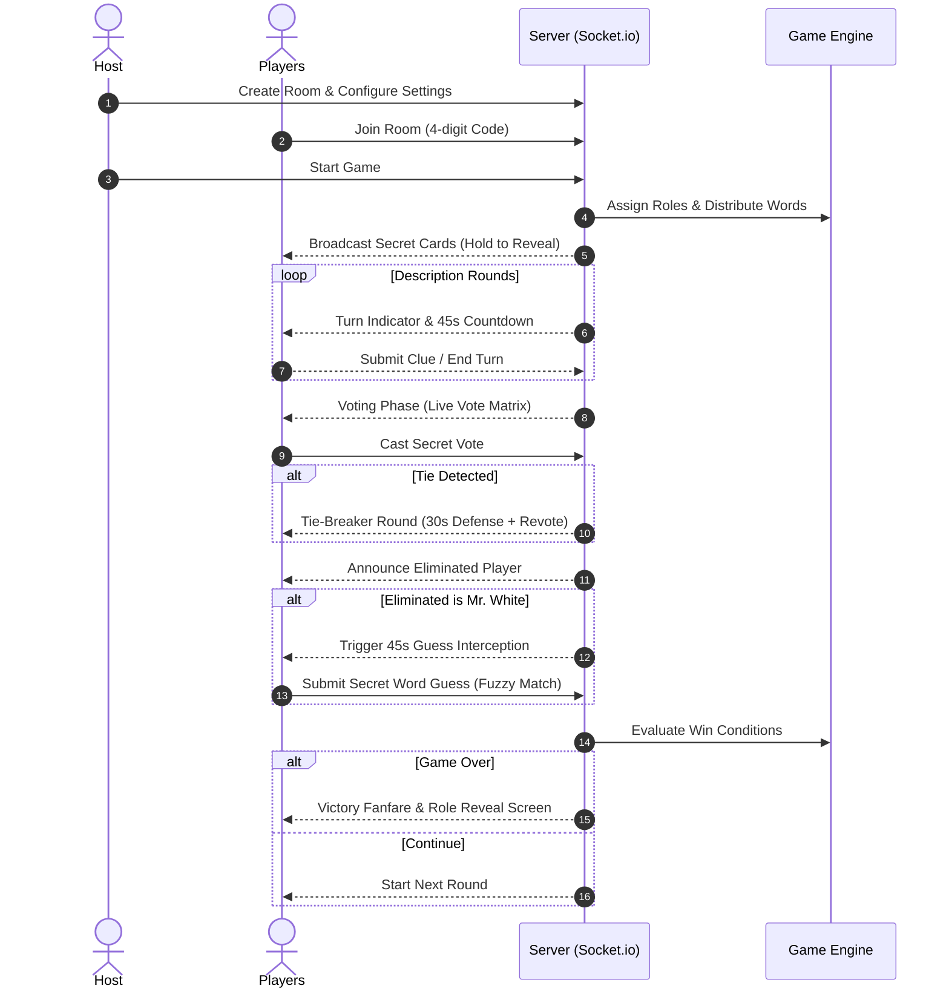

# 🕵️ What's The Word (Undercover)

<div align="center">


**A high-stakes, cyber-sleek social deduction & word party game.**  
*Available in both Single-Device Pass & Play (Offline) and Multi-Device Realtime Rooms (Online).*

[Features](#-features) • [Role Guide](#-role-guide--win-conditions) • [Game Modes](#-dual-game-modes) • [Tech Stack](#️-tech-stack--architecture) • [Getting Started](#-getting-started) • [Database Setup](#-supabase-database-setup) • [Deployment](#-deployment-guide)

</div>

---

## 📖 Overview

**What's The Word** is a modern, responsive web adaptation of the popular party game *Undercover*. Players receive secret words belonging to a specific topic—except one or more players receive slightly different words (Undercovers), or no word at all (Mr. White). Through clever, deceptive 1-sentence clues and intense rounds of voting, players must deduce who is telling the truth and who is faking it!

Designed with a **Sleek Cyber Dark UI**, fluid Motion animations, procedural Web Audio SFX, and full Indonesian & English vocabulary support.

---

## 🎭 Role Guide & Win Conditions

```
                                  ┌──────────────────────────┐
                                  │      PLAYER POOL         │
                                  └─────────────┬────────────┘
                        ┌───────────────────────┼───────────────────────┐
                        ▼                       ▼                       ▼
            ┌───────────────────────┐ ┌───────────────────┐ ┌───────────────────┐
            │   CIVILIAN (Warga)    │ │ UNDERCOVER (Spy)  │ │ MR. WHITE (Blind) │
            │   "Kopi" (Secret)     │ │   "Teh" (Similar) │ │   "???" (Blank)   │
            └───────────┬───────────┘ └─────────┬─────────┘ └─────────┬─────────┘
                        │                       │                     │
                        ▼                       ▼                     ▼
               Eliminate all Spies      Equal/Outnumber       Guess Civilian Word
                 and Mr. White             Civilians           or Survive to End
```

### 1. 🛡️ Civilian (Warga)
- **Secret Word**: Receives the majority secret word (e.g., *"Kopi"*).
- **Goal**: Identify and eliminate all Undercovers and Mr. White before they outnumber Civilians.
- **Strategy**: Give clues subtle enough that fellow Civilians understand, but vague enough that Undercovers cannot blend in easily.

### 2. 🕵️ Undercover (Impostor)
- **Secret Word**: Receives a closely related word in the same category (e.g., *"Teh"*).
- **Goal**: Survive until the number of active Undercovers equals or exceeds the number of remaining Civilians.
- **Strategy**: Blend in with Civilian clues, identify the real Civilian word early, and deflect suspicion onto others.

### 3. 👤 Mr. White (The Chameleon)
- **Secret Word**: Receives no word at all (*"???"*).
- **Goal**:
  1. **Instant Win**: When voted out, guess the exact Civilian secret word in a 45-second buzzer round (assisted by intelligent fuzzy matching).
  2. **Survival Win**: Stay alive until only 2 players remain.
- **Strategy**: Listen attentively to other players' clues, construct convincing bluff statements, and crack the secret word.

---

## 📱 Dual Game Modes

### 🌐 Mode 1: Online Multi-Device Rooms (Socket.io)
- **4-Character Room Codes**: Instant room generation and shareable invite links.
- **Realtime Sync**: Sub-millisecond WebSocket state synchronization powered by Socket.io.
- **Session Reconnect**: Resilient connection recovery if a player refreshes or drops Wi-Fi.
- **Customizable Lobby**: Adjust Civilian/Undercover/Mr. White sliders, turn timers (15s–90s), and custom category packs.
- **Spectator Mode**: Eliminated players transition to spectator mode to watch the drama unfold.

### 📴 Mode 2: Offline Pass & Play (1 HP / Single Device)
- **No Internet Required**: Perfect for road trips, cafes, and gatherings with limited connectivity.
- **Interactive Card Reveal**: Haptic-style "Hold to Reveal" privacy card prevent screen peeking.
- **Guided Handoff Screen**: Prompts to securely hand the phone to the next player.
- **Built-in Timer & Voting Manager**: Automated turn rotation, tie-breaker handling, and Mr. White guess interceptor on a single screen.

---

## 🛠️ Tech Stack & Architecture

### Frontend (`/client`)
- **Core Framework**: React 18 with Vite 6 & TypeScript 5
- **Styling**: Tailwind CSS v3 with custom Neon Cyber theme (`#0a0f1d` deep space dark mode)
- **Motion & UI**: Framer Motion (`motion`), Lucide React icons, Canvas Confetti
- **Audio Synthesis**: Native Web Audio API (`soundSynthesizer.ts`) generating zero-latency procedural SFX (ticks, stingers, buzzer, victory fanfares)
- **Data Layer**: Supabase JS Client for community word pack storage & exploration

### Backend (`/server`)
- **Runtime**: Node.js & Express with TypeScript
- **Realtime**: Socket.io v4 with strongly-typed client-server event contracts
- **Game Engine**: In-memory state machine (`GameEngine.ts`, `RoomManager.ts`, `WordManager.ts`)
- **Fuzzy Matching**: Levenshtein Distance & Dice Coefficient algorithm (`FuzzyMatcher.ts`) for flexible Mr. White guess validation

### Database (`/supabase`)
- **PostgreSQL**: Hosted on Supabase with Row Level Security (RLS) policies
- **Tables**: `word_packs` (curated bilingual pairs) & `custom_packs` (community creations with 6-char share codes)

---

## 🚀 Getting Started

### Prerequisites
- **Node.js**: `v18.0.0` or newer
- **npm**: `v9.0.0` or newer

### Installation

1. **Clone the repository**:
   ```bash
   git clone https://github.com/ALIFKA-HUB/WhatsTheWord.git
   cd WhatsTheWord
   ```

2. **Install all workspace dependencies**:
   ```bash
   npm run install:all
   ```

3. **Configure Environment Variables**:
   Create a `.env` file in the root directory (or copy from `.env.example`):
   ```env
   # Supabase Configuration (Optional for offline, required for custom packs)
   VITE_SUPABASE_URL=https://your-project.supabase.co
   VITE_SUPABASE_ANON_KEY=your-anon-key

   # Server Port
   PORT=3001
   ```

4. **Start Development Servers**:
   ```bash
   npm run dev
   ```
   - Client will be running at: `http://localhost:5173`
   - Server will be running at: `http://localhost:3001`

---

## 🧪 Available Scripts

| Command | Description |
|---|---|
| `npm run dev` | Runs both client (Vite) and server (tsx watch) concurrently |
| `npm run dev:client` | Starts only the frontend Vite development server (`:5173`) |
| `npm run dev:server` | Starts only the backend Express/Socket.io server (`:3001`) |
| `npm run build` | Builds both frontend SPA (`client/dist`) and backend TypeScript (`server/dist`) |
| `npm run typecheck` | Runs TypeScript compiler checks across all workspaces |
| `npm test` | Executes Vitest unit & integration test suite |

---

## 🗄️ Supabase Database Setup

To enable community word pack publishing and dynamic cloud-based word packs:

1. Open your [Supabase Dashboard](https://supabase.com/dashboard) and navigate to the **SQL Editor**.
2. Copy and paste the contents of `supabase/schema.sql` into the editor.
3. Click **Run**. This script will:
   - Create the `word_packs` table and seed 60+ curated Indonesian word pairs across 5 categories (Makanan, Hewan, Gadget, Tempat, Profesi).
   - Create the `custom_packs` table with share code indexes.
   - Configure public read & insert Row Level Security (RLS) policies.
4. Copy your project URL and `anon` key to your `.env` file.

---

## 🌐 Deployment Guide

### 1. Frontend (Vercel)
The project includes a root `vercel.json` preconfigured for Vite single-page applications:
1. Push your repository to GitHub.
2. Import the repository into [Vercel](https://vercel.com).
3. Set the **Framework Preset** to `Vite`.
4. Configure environment variables in the Vercel dashboard:
   - `VITE_SUPABASE_URL`
   - `VITE_SUPABASE_ANON_KEY`
5. Click **Deploy**. Vercel will build `client/dist` and apply SPA rewrites and asset cache headers.

### 2. Backend (Render / Railway / VPS)
For the realtime Socket.io server:
1. **Render / Railway**:
   - Root Directory: `server` (or run from root with `npm run build:server`)
   - Build Command: `npm install && npm run build`
   - Start Command: `npm start`
   - Environment Variable: `PORT=3001` (or dynamic host port)
2. In production, update the client's Socket.io connection URL in `client/src/context/SocketContext.tsx` to point to your deployed backend service.

---

## 🎮 Gameplay Flowchart



---

## 📄 License

This project is licensed under the [MIT License](LICENSE). Built with ❤️ for party game enthusiasts.
