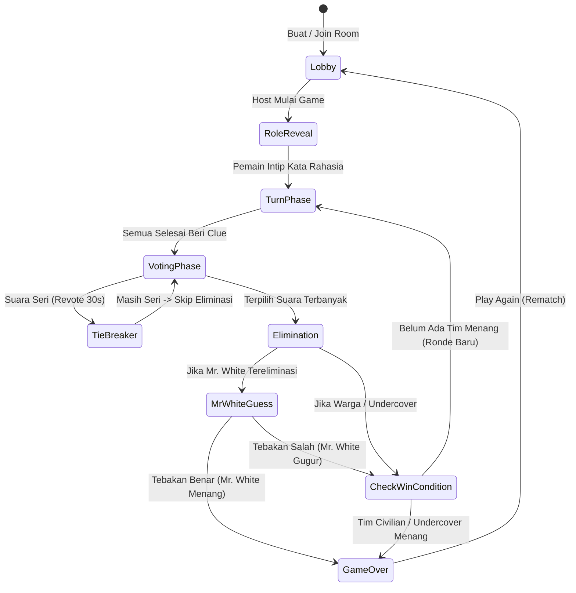

# Undercover Web Game - Product Requirements & Technical Design (PRD)

> **Document Type:** Product Requirements Document (PRD) & Architecture Spec  
> **Date:** 2026-09-02  
> **Status:** Approved / Ready for Implementation  
> **Target Path:** `games/undercover/`

---

## 1. Executive Summary & Vision

**Undercover Web** adalah game *social deduction / word party game* berbasis web yang dirancang untuk dimainkan secara kasual baik secara langsung bersama teman di satu ruangan maupun secara online.

Game ini mendukung **dua mode permainan utama (Hybrid)**:
1. **Multi-Device Room (Online)**: Setiap pemain menggunakan smartphone/browser masing-masing dan terhubung via kode room 4-digit secara realtime via Socket.io.
2. **Single-Device Pass & Play (Offline / 1 HP)**: Game dipandu oleh 1 layar bersama, pemain mengoper perangkat secara bergantian untuk melihat peran & kata rahasia.

---

## 2. Core Gameplay & Rules

### 2.1 Peran (Roles)
- **Civilian (Warga)**: Mendapatkan kata rahasia mayoritas (contoh: *"Kopi"*). Tujuan: menemukan dan mengeliminasi semua Undercover dan Mr. White.
- **Undercover (Impostor)**: Mendapatkan kata rahasia yang mirip tetapi berbeda (contoh: *"Teh"*). Tujuan: bertahan hidup sampai jumlah Undercover setara dengan Civilian.
- **Mr. White (Orang Buta Kata - Opsi Toggle On/Off)**: Tidak mendapatkan kata sama sekali (muncul *"???"*). Tujuan: menebak kata rahasia Civilian saat tereliminasi ATAU bertahan hidup hingga akhir permainan.

### 2.2 Distribusi Peran Standar
| Jumlah Pemain | Civilian | Undercover | Mr. White (Opsi) |
|---|---|---|---|
| 3-4 pemain | 2-3 | 1 | 0 |
| 5-6 pemain | 3-4 | 1 | 1 |
| 7-9 pemain | 4-6 | 2 | 1 |
| 10+ pemain | 6+ | 2-3 | 1-2 |

*Host dapat mengkustomisasi jumlah masing-masing role secara manual melalui slider di Lobby.*

### 2.3 Alur Permainan (Game Loop)



1. **Role Reveal Phase**:
   - Kartu rahasia dengan tombol interaktif *"Tahan untuk Intip Kata"* (Flip / Hold card).
   - Di mode Pass & Play: terdapat tombol *"Oper HP ke [Nama Pemain Selanjutnya]"*.
2. **Turn-Based Description Phase**:
   - Sistem mengacak giliran urutan pemain.
   - Layar menampilkan: *"Giliran [Nama Pemain] memberikan 1 kata/kalimat petunjuk!"*.
   - Timer countdown visual (default 30-45 detik) dengan sound effect detak detik terakhir.
3. **Voting Phase**:
   - Setiap pemain aktif memilih 1 pemain yang dicurigai sebagai Impostor/Mr. White.
   - Hasil voting dihitung secara transparan.
   - **Tie-Breaker Rule**: Jika 2 pemain memiliki jumlah suara seri tertinggi, masuk ke babak pembelaan 30 detik untuk kedua pemain lalu revote khusus 2 kandidat tersebut. Jika masih seri, ronde lanjut tanpa eliminasi.
4. **Mr. White Guess Interception**:
   - Jika pemain yang tereliminasi adalah Mr. White, muncul modal darurat: Mr. White diberi kesempatan 45 detik untuk mengetik tebakan kata Warga.
   - Jika cocok (fuzzy match / exact match case-insensitive): **Mr. White MENANG INSTAN!**
   - Jika salah: Mr. White gugur dan game dilanjutkan.
5. **Win Conditions**:
   - **Civilian Victory**: Semua Undercover dan Mr. White berhasil dieliminasi.
   - **Undercover Victory**: Jumlah Undercover yang bertahan >= jumlah Civilian yang bertahan.
   - **Mr. White Victory**: Sukses menebak kata Civilian saat tereliminasi, ATAU bertahan hingga tersisa 2 pemain.

---

## 3. Tech Stack & Project Architecture

### 3.1 Stack
- **Frontend (`games/undercover/client/`)**:
  - React 18 / Vite / TypeScript
  - Tailwind CSS v4 (Sleek Dark Cyber theme)
  - Lucide Icons & Phosphor Icons
  - Motion (`motion/react`) untuk animasi kartu dan transisi status
  - Web Audio API (Synthesized & lightweight SFX)
- **Backend (`games/undercover/server/`)**:
  - Node.js / Express / TypeScript
  - Socket.io (WebSocket realtime communication)
  - In-memory Room & Game State Manager
  - Player Session Token & Auto-reconnect handling

### 3.2 Directory Structure
```
games/undercover/
├── client/
│   ├── index.html
│   ├── package.json
│   ├── vite.config.ts
│   ├── tailwind.config.js / style.css
│   └── src/
│       ├── assets/              # Sound SFX & Icons
│       ├── components/
│       │   ├── common/          # Button, Modal, Card, Badge, Header
│       │   ├── game/            # SecretCard, TurnIndicator, Timer, VotingGrid, MrWhiteModal
│       │   └── lobby/           # PlayerList, CategorySelector, RoleConfigSlider
│       ├── context/             # SocketContext, GameContext, AudioContext
│       ├── data/                # wordPacks.ts (Kategori Bawaan Bahasa Indonesia)
│       ├── hooks/               # useGameSound.ts, useCountdown.ts, useSocket.ts
│       ├── pages/               # HomePage, LobbyPage, PassPlayPage, RoomPage, GameOverPage
│       ├── types/               # game.types.ts
│       └── utils/               # soundSynthesizer.ts, stringMatcher.ts
└── server/
    ├── package.json
    ├── tsconfig.json
    └── src/
        ├── handlers/            # roomHandler.ts, gameHandler.ts, voteHandler.ts
        ├── managers/            # RoomManager.ts, WordManager.ts, GameManager.ts
        ├── types/               # socket.types.ts, room.types.ts
        └── server.ts            # Entrypoint
```

---

## 4. UI/UX & Visual Guidelines (Sleek Dark Cyber)

- **Theme Palette**:
  - Background Base: `#0a0f1d` (Deep Void Navy) & `#111827` (Card Surface)
  - Accents:
    - Civilian: `#06b6d4` (Cyan Glow)
    - Undercover: `#f43f5e` (Crimson Neon)
    - Mr. White: `#a855f7` (Electric Purple Glow)
    - Warning/Timer: `#f59e0b` (Amber)
- **Responsive Mobile First**:
  - Layout dioptimalkan untuk layar smartphone vertikal (portrait 360px - 430px) dan desktop horizontal.
  - Safe area padding untuk mobile browser header/bottom bar.
- **Audio Sound FX Engine**:
  - Countdown tick audio (gentle ping per second, fast pulse < 5s).
  - Role Reveal suspense synth stinger.
  - Voting click buzzer.
  - Victory fanfare & Defeat stinger.
  - Toggle Mute audio button di pojok kanan atas.

---

## 5. Word Bank & Kategori Bawaan (Bahasa Indonesia)

Database kata bawaan mencakup pasangan kata seimbang:
1. **Makanan & Minuman**:
   - (Kopi, Teh), (Bakso, Mie Ayam), (Rendang, Gulai), (Nasi Goreng, Mie Goreng), (Martabak Manis, Terang Bulan), (Es Kelapa, Es Cendol)
2. **Hewan**:
   - (Kucing, Harimau), (Lumba-lumba, Paus), (Bebek, Ayam), (Kelinci, Hamster), (Elang, Burung Hantu)
3. **Benda & Gadget**:
   - (Laptop, Komputer), (Smartphone, Tablet), (Earphone, Headphone), (Kipas Angin, AC), (Jam Tangan, Jam Dinding)
4. **Tempat & Hiburan**:
   - (Bioskop, Teater), (Pantai, Danau), (Supermarket, Pasar Tradisional), (Museum, Perpustakaan), (Hotel, Villa)
5. **Profesi**:
   - (Dokter, Perawat), (Pilot, Masinis), (Polisi, Tentara), (Koki, Barista), (Guru, Dosen)
6. **Custom Word Pack**:
   - Host dapat menambahkan kata kustom sendiri secara langsung dari menu Room Settings.

---

## 6. Socket Realtime Event Specification

| Event Name | Direction | Payload | Deskripsi |
|---|---|---|---|
| `room:create` | Client -> Server | `{ playerName, avatar }` | Membuat room baru, return `roomId` & `playerToken` |
| `room:join` | Client -> Server | `{ roomId, playerName, avatar, playerToken? }` | Masuk ke room yang sudah ada |
| `room:update` | Server -> Client | `{ roomState }` | Broadcast data pemain & setting room |
| `game:start` | Client -> Server | `{ roomId, settings }` | Host memulai permainan |
| `game:state` | Server -> Client | `{ phase, round, currentTurn, players, secretWord? }` | Broadcast state ronde |
| `turn:end` | Client -> Server | `{ roomId }` | Pemain selesai berbicara / timeout |
| `vote:cast` | Client -> Server | `{ roomId, targetPlayerId }` | Mengirim vote rahasia |
| `mrwhite:guess` | Client -> Server | `{ roomId, guessedWord }` | Mr. White mengirim tebakan kata |
| `game:over` | Server -> Client | `{ winnerRole, playersWithRoles, wordPair }` | Broadcast hasil game akhir |
| `player:reconnect` | Client -> Server | `{ roomId, playerToken }` | Memulihkan session pemain yang disconnect |
